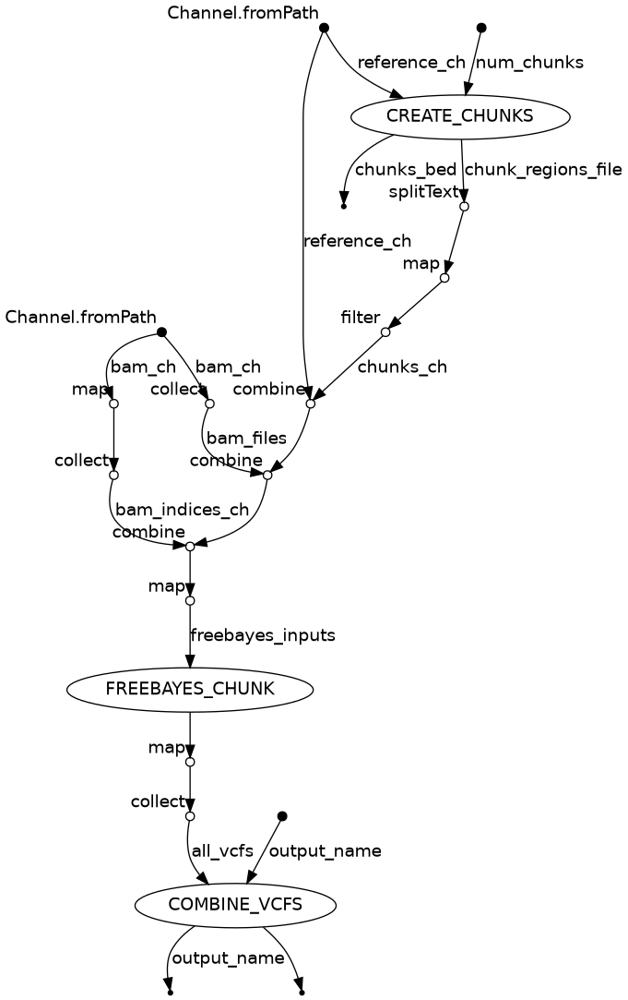

# gcl_snp_calling

## Folder Structure
```
📁 project-root/
├── 📁 gcl_snp_calling/               # All Nextflow workflow logic
│   ├── 📄 main.nf                    # Entry point for pipeline
│   ├── 📄 nextflow.config            # SLURM and container config
│   ├── 📄 freebayes_parameters.json  # Example Parameter config file for freebayes
│   ├── 📄 README.md                  # Usage and documentation
│   └── 📁 modules/                   # Individual DSL2 module processes
│       ├── create_chunks.nf
│       ├── freebayes_chunk.nf
│       ├── combine_vcfs.nf
├── 📁 data/bam                       # Input BAM Files
├── 📁 genome/                        # Downloaded and indexed reference
├── 📁 logs/                          # SLURM/Nextflow job logs
```

## To Run

1. Clone repo into your directory.
2. Run the pipeline from the project root:

```bash
nextflow run gcl_snp_calling/main.nf \
    -profile slurm \
    -resume \
    --bams "./data/bam/*.bam" \
    --reference "./genome/genome.fa" \
    --freebayes_config gcl_snp_calling/freebayes_parameters.json \
    --num_chunks 25 \
    --output_dir "data/snps" \
    --output_vcf "all_samples.vcf.gz"
```
3. Or Run in SLURM `sbatch run_snpCall.sbatch {freebayes_parameters.json} 25`