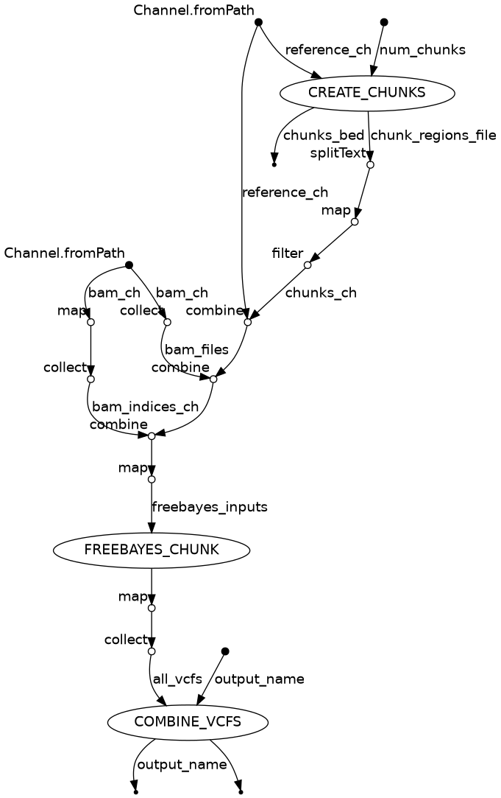

# gcl_snp_calling [](https://doi.org/10.5281/zenodo.19666917)


This pipeline takes a directory of mapped and indexed BAM files, filters them, and performs SNP calling using [FreeBayes](https://github.com/freebayes/freebayes). It is written in [Nextflow](https://www.nextflow.io/) DSL2 and is designed to be run either directly or via SLURM using the provided sbatch script. The pipeline supports both individual samples and pooled sequencing with different numbers of individuals per pool.

---

## 🔧 Tools Used

| Tool | Purpose | Link |
|------|---------|------|
| [samtools](http://www.htslib.org/) | BAM file filtering and indexing | https://www.htslib.org/ |
| [freebayes](https://github.com/freebayes/freebayes) | Variant calling | https://github.com/freebayes/freebayes |
| [bcftools](http://www.htslib.org/doc/bcftools.html) | VCF filtering and manipulation | https://samtools.github.io/bcftools/ |

---

## Folder Structure
```
📁 project-root/
├── 📁 gcl_snp_calling/             # ✅ Must be present (cloned repo)
│   ├── 📄 main.nf                  # Entry point for the pipeline
│   ├── 📄 nextflow.config          # Execution and profile config
│   ├── 📄 run_snpCall.sbatch       # SLURM submission script
│   └── 📁 modules/                 # Individual module processes
│       ├── combine_vcfs.nf
│       ├── create_chunks.nf
│       ├── filter_bam.nf
│       ├── freebayes_chunk.nf
│       ├── summarize_vcf.nf
├── 📁 data/                          
│   ├── 📁 bam/                     # ✅ Must be present (unfiltered BAM files - can be output by [QC Pipeline](https://github.com/tamucc-gcl/gcl_illumina_qc))
│   ├── 📁 snps/                    # 🚀 Created by pipeline
├── 📁 genome/                       # ✅ Must be present Downloaded and indexed reference (can be created by [QC Pipeline](https://github.com/tamucc-gcl/gcl_illumina_qc))
├── 📄 ploidy_map.txt                # 📝 Optional: Per-BAM ploidy specification for pooled samples
├── 📁 logs/                         # SLURM/Nextflow job logs
```

## Parameter Setting Files
- Example: [BAM Filter Settings](config_files/bam_filter_parameters.json)
- Example: [freebayes Settings](config_files/freebayes_parameters.json)
- Optional: Ploidy/CNV Map (see below for format)

### Ploidy/CNV Map File Format

For pooled sequencing with different numbers of individuals per BAM file, you can provide a ploidy map file:

```
# ploidy_map.txt
# Format: bam_filename<TAB>ploidy
# For pooled samples: ploidy = number_of_individuals × 2 (for diploid organisms)
pool1.filtered.bam	40	# 20 diploid individuals
pool2.filtered.bam	60	# 30 diploid individuals
pool3.filtered.bam	20	# 10 diploid individuals
```

**When ploidy map is provided:**
- Each BAM file will be analyzed with its specified ploidy
- The ploidy values in the map override any global ploidy setting in the FreeBayes config
- Ideal for pooled sequencing experiments with known pool sizes

**When ploidy map is NOT provided:**
- FreeBayes uses the global ploidy value from the config file (default: 2 for diploid)
- All BAM files are assumed to have the same ploidy
- Suitable for individual samples or pools with uniform size

---

## To Run

### For Individual Samples (Default)

1. Clone repo into your directory.
2. Run the pipeline from the project root:

```bash
nextflow run gcl_snp_calling/main.nf \
    -profile slurm \
    -resume \
    --bams "./data/bam/*.bam" \
    --reference "./genome/genome.fa" \
    --freebayes_config {freebayes_parameters} \
    --bam_filter_config {bam_filter_parameters} \
    --num_chunks {nChunk} \
    --output_dir "data/snps" \
    --output_vcf "raw_variants.vcf.gz"
```
3. Or Run in SLURM `sbatch run_snpCall.sbatch {freebayes_parameters.json} {bam_filter_parameters} 25`

### For Pooled Samples with Different Pool Sizes

1. Create a ploidy map file specifying the number of individuals in each pool:
```bash
# Create ploidy_map.txt
echo "pool1.bam	40" > ploidy_map.txt  # 20 individuals
echo "pool2.bam	60" >> ploidy_map.txt # 30 individuals
echo "pool3.bam	20" >> ploidy_map.txt # 10 individuals
```

2. Run the pipeline with the ploidy map:
```bash
nextflow run gcl_snp_calling/main.nf \
    -profile slurm \
    -resume \
    --bams "./data/bam/*.bam" \
    --reference "./genome/genome.fa" \
    --freebayes_config {freebayes_parameters} \
    --bam_filter_config {bam_filter_parameters} \
    --ploidy_map ploidy_map.txt \
    --num_chunks {nChunk} \
    --output_dir "data/snps" \
    --output_vcf "pooled_samples.vcf.gz"
```

3. Or Run in SLURM with ploidy map: `sbatch run_snpCall.sbatch {freebayes_parameters.json} {bam_filter_parameters} 25 ploidy_map.txt`

### Important Notes for Pooled Sequencing

When using pooled samples, adjust your FreeBayes config:
- Set `"pooled_discrete": true` for known pool sizes
- Set `"pooled_continuous": true` for unknown/variable pool sizes  
- Lower `min_alternate_fraction` (e.g., 0.01 for 1% frequency)
- Increase `min_coverage` and `max_coverage` appropriately

---

## Customizing Resources

Edit `gcl_snp_calling/run_snpCall.sbatch` to customize resources used by orchestra conductor job (e.g., CPUs, memory, partition).

Edit `gcl_snp_calling/nextflow.config` to customize resources used by each pipeline stage (e.g., CPUs, memory, partition).
